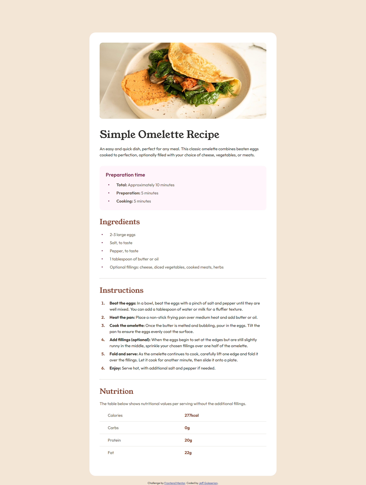

# Frontend Mentor - Recipe page solution

This is a solution to the [Recipe page challenge on Frontend Mentor](https://www.frontendmentor.io/challenges/recipe-page-KiTsR8QQKm). 
## Table of contents

- [Overview](#overview)
  - [The challenge](#the-challenge)
  - [Screenshot](#screenshot)
  - [Links](#links)
- [My process](#my-process)
  - [Workflow](#workflow)
  - [Built with](#built-with)
  - [What I learned](#what-i-learned)
  - [Continued development](#continued-development)
- [Author](#author)
- [Acknowledgements](#acknowledgements)

## Overview

### The challenge

Your challenge is to build out this recipe page and get it looking as close to the design as possible.

You can use any tools you like to help you complete the challenge. So if you've got something you'd like to practice, feel free to give it a go.

**Additional challenges:**

- Create a more fluid transition between the 768px and 375px sizes. Without this change (at 500px), the picture becomes very distorted and some of the text collapses and is not as easy to read.
- Use a table to organize the nutritional information at the bottom of the recipe. While I could have created the same effect with a series of flex containers, I felt like doing so would be less organized and more difficult to understand that a table structure.

### Screenshot

Take a look at my other screenshots:

[Screenshot at 768px](/screenshots/screenshot_768px.png)

[Screenshot at 375px](/screenshots/screenshot_375px.png)

### Links

- Solution URL: [See my solution on GitHub](https://github.com/jguleserian/FMC-Recipe-Page)
- Live Site URL: [See the live site here](https://jguleserian.github.io/FMC-Recipe-Page/)

## My process

### Workflow:

1. Set up folders and file structure, set up README.md, create GitHub repo and link it to VS Code 
2. Determine strategy for structuring the page
3. HTML: set major structure with containers, placing the general content within them
4. HTML: starting from the top with each major container, assign content to individual elements and arrange them as necessary.
5. HTML: link and place <picture> and  / <source> files as necessary. Set media query sizes as necessary.
6. CSS: set up.
  - "Pencil in" the major structure using GPS: "reset & variables," "containers," "elements," "classes & ids," "media queries"
  - Write the CSS for the page reset in the ":root," <html>, <body>, and *. I generally put in the variable for colors, font, etc. at this time.
  - Set the media queries, adding in a change of background color so I can visually identify what query I am viewing and to have an element in the query as a placeholder
7. Starting from top to bottom in the HTML, set the CSS styles. 
8. Style/add hover states and animation as necessary
9. Clean up code
10. Test functionality, responsiveness, and similitud with original model in Figma/style guide
11. Upload and publish

### Built with

- Semantic HTML5 markup
- CSS custom properties
- Flexbox
- HTML Table
- Mobile-first workflow

### What I learned

This project really challenged me to learn how to customize the bullet poins of ordered and unordered list. 

Additionally, this is the first project in which I could utilize an HTML table. While I could have created the same effect using a series of flex containers, I liked the idea of using the table since that is actually what appears in the recipe, a table. Moreover, I felt like the HTML has better visual organization in a table structure than in a series of flex containers.

### Continued development

I am looking forward to being able to tackle the customized bullet poins and text alignment in ordered and unordered lists with greater ease. I still feel like I have a lot to learn about this subject and would welcome any feedback or advice.

## Author

- GitHub - [@jguleserian](https://github.com/jguleserian)
- Frontend Mentor - [@jguleserian](https://www.frontendmentor.io/profile/jguleserian)
- LinkedIn - [@jeffguleserian](https://www.linkedin.com/jeffguleserian)

## Acknowledgements

I am indebted to Sergei, @wonderlust101, for his taking the time to look into my issues mentioned above. He showed me my error in how I was referencing the .svg from the styles.css and subsequently, why it was not showing up in Pages on GitHub.

